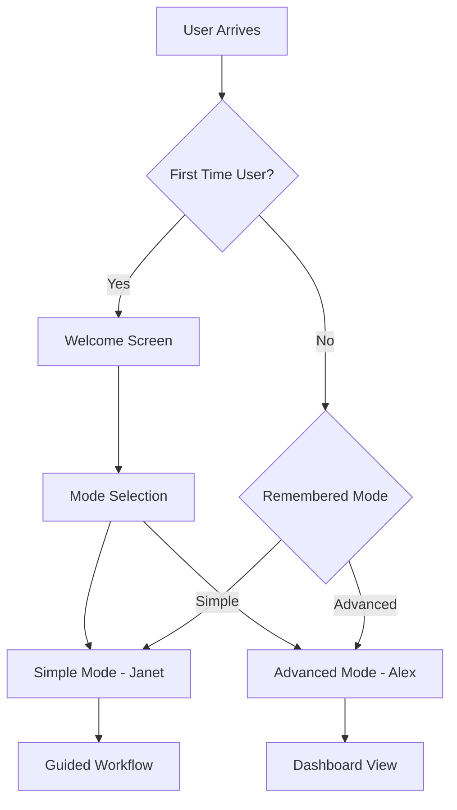

# AccessForm UI Workflow and User Journey Specification

## Overview
This document defines the complete user workflow and interface design for AccessForm, addressing both Janet (non-technical user) and Alex (power user) personas. The design prioritizes clarity, accessibility, and progressive disclosure of complexity.

## Core Workflow Philosophy

### Design Principles
1. **Progressive Disclosure**: Start simple, reveal complexity only when needed
2. **Clear Communication**: Always explain what's happening in plain language
3. **Error Prevention**: Guide users away from mistakes before they happen
4. **Graceful Recovery**: When errors occur, provide clear paths forward
5. **Visual Progress**: Show where users are and what's coming next

## Primary User Journey

### Entry Point Decision Tree



## Mode 1: Simple Mode (Janet's Journey)

### Welcome & Onboarding

```
┌─────────────────────────────────────────────────────────┐
│                                                         │
│              Welcome to AccessForm! 👋                  │
│                                                         │
│    Let's convert your Word document to an              │
│    accessible PDF form in just a few steps.            │
│                                                         │
│    ┌─────────────────────────────────────────┐         │
│    │                                         │         │
│    │     📄 Drop your Word file here        │         │
│    │         or click to browse             │         │
│    │                                         │         │
│    │     [Select File]                      │         │
│    └─────────────────────────────────────────┘         │
│                                                         │
│    No technical knowledge needed!                       │
│    We'll guide you through everything.                  │
│                                                         │
│    [Need help?]                [Advanced Options ⚙️]    │
└─────────────────────────────────────────────────────────┘
```

### Step-by-Step Wizard Flow

#### Step 1: File Upload
```
┌─────────────────────────────────────────────────────────┐
│  Step 1 of 5: Upload Your Document                     │
├─────────────────────────────────────────────────────────┤
│                                                         │
│  ┌───┐ ┌───┐ ┌───┐ ┌───┐ ┌───┐                       │
│  │ 1 │─│ 2 │─│ 3 │─│ 4 │─│ 5 │  Progress             │
│  └─●─┘ └───┘ └───┘ └───┘ └───┘                       │
│                                                         │
│  ┌─────────────────────────────────────────┐          │
│  │                                         │          │
│  │    📄 YourForm.docx                    │          │
│  │                                         │          │
│  │    ✅ File uploaded successfully        │          │
│  │    Size: 2.3 MB                        │          │
│  │    Pages: 12                           │          │
│  │                                         │          │
│  │    [Change File]                       │          │
│  └─────────────────────────────────────────┘          │
│                                                         │
│  What we'll do with your file:                         │
│  • Find all the form fields                            │
│  • Make them fillable                                  │
│  • Add accessibility features                          │
│  • Create a PDF you can download                       │
│                                                         │
│  [← Back]                           [Continue →]       │
└─────────────────────────────────────────────────────────┘
```

#### Step 2: Processing & Field Detection
```
┌─────────────────────────────────────────────────────────┐
│  Step 2 of 5: Finding Your Form Fields                 │
├─────────────────────────────────────────────────────────┤
│                                                         │
│  ┌───┐ ┌───┐ ┌───┐ ┌───┐ ┌───┐                       │
│  │ 1 │─│ 2 │─│ 3 │─│ 4 │─│ 5 │                       │
│  └───┘ └─●─┘ └───┘ └───┘ └───┘                       │
│                                                         │
│  🔍 Analyzing your document...                         │
│                                                         │
│  ┌─────────────────────────────────────────┐          │
│  │                                         │          │
│  │  Current Activity:                      │          │
│  │  ► Reading page 3 of 12                │          │
│  │  ► Found 47 fields so far              │          │
│  │                                         │          │
│  │  [████████████░░░░░░░░] 65%           │          │
│  │                                         │          │
│  │  Fields Found:                          │          │
│  │  ✓ 15 Text fields                      │          │
│  │  ✓ 12 Checkboxes                       │          │
│  │  ✓ 8 Date fields                       │          │
│  │  ✓ 6 Signatures                        │          │
│  │  ✓ 6 Dropdowns                         │          │
│  │                                         │          │
│  └─────────────────────────────────────────┘          │
│                                                         │
│  ⏱️ This usually takes 1-2 minutes                     │
│  Feel free to grab a coffee!                          │
│                                                         │
└─────────────────────────────────────────────────────────┘
```

#### Step 3: Review & Simple Adjustments
```
┌─────────────────────────────────────────────────────────┐
│  Step 3 of 5: Quick Review                             │
├─────────────────────────────────────────────────────────┤
│                                                         │
│  ┌───┐ ┌───┐ ┌───┐ ┌───┐ ┌───┐                       │
│  │ 1 │─│ 2 │─│ 3 │─│ 4 │─│ 5 │                       │
│  └───┘ └───┘ └─●─┘ └───┘ └───┘                       │
│                                                         │
│  Great! We found 73 form fields.                       │
│                                                         │
│  ┌─────────────────────────────────────────┐          │
│  │ Form Preview                           │          │
│  │                                         │          │
│  │ Page 1:                                │          │
│  │ ┌─────────────────────────┐           │          │
│  │ │ Name: [_______________]  │ ✓        │          │
│  │ │ Date: [_______________]  │ ✓        │          │
│  │ │ Email: [______________]  │ ⚠️       │          │
│  │ └─────────────────────────┘           │          │
│  │                                         │          │
│  │ ⚠️ 3 fields need your attention        │          │
│  │                                         │          │
│  └─────────────────────────────────────────┘          │
│                                                         │
│  Quick Settings:                                       │
│  ☑️ Make required fields mandatory                     │
│  ☑️ Add helpful hints to complex fields               │
│  ☑️ Include accessibility features                     │
│                                                         │
│  [← Back]          [Fix Issues]      [Continue →]     │
└─────────────────────────────────────────────────────────┘
```

#### Step 4: Processing Options (Simplified)
```
┌─────────────────────────────────────────────────────────┐
│  Step 4 of 5: Choose Your Settings                     │
├─────────────────────────────────────────────────────────┤
│                                                         │
│  ┌───┐ ┌───┐ ┌───┐ ┌───┐ ┌───┐                       │
│  │ 1 │─│ 2 │─│ 3 │─│ 4 │─│ 5 │                       │
│  └───┘ └───┘ └───┘ └─●─┘ └───┘                       │
│                                                         │
│  How should people use this form?                      │
│                                                         │
│  ○ Print and fill by hand                             │
│  ● Fill on computer (Recommended)                     │
│  ○ Both                                                │
│                                                         │
│  Who will fill out this form?                         │
│                                                         │
│  ● Citizens/Clients                                    │
│  ○ Government staff only                              │
│  ○ Both                                                │
│                                                         │
│  Form Information:                                     │
│  ┌─────────────────────────────────────────┐          │
│  │ Form Title: [Auto-detected title     ] │          │
│  │ Form Number: [VR-3472                ] │          │
│  │ Department: [Your Department         ] │          │
│  └─────────────────────────────────────────┘          │
│                                                         │
│  [← Back]                           [Create PDF →]     │
└─────────────────────────────────────────────────────────┘
```

#### Step 5: Download & Complete
```
┌─────────────────────────────────────────────────────────┐
│  Step 5 of 5: Your PDF is Ready! 🎉                    │
├─────────────────────────────────────────────────────────┤
│                                                         │
│  ┌───┐ ┌───┐ ┌───┐ ┌───┐ ┌───┐                       │
│  │ 1 │─│ 2 │─│ 3 │─│ 4 │─│ 5 │                       │
│  └───┘ └───┘ └───┘ └───┘ └─●─┘                       │
│                                                         │
│  ✅ Success! Your accessible PDF form is ready.        │
│                                                         │
│  ┌─────────────────────────────────────────┐          │
│  │                                         │          │
│  │     📄 YourForm_Accessible.pdf         │          │
│  │                                         │          │
│  │     [📥 Download PDF]                  │          │
│  │                                         │          │
│  │     [👁️ Preview in Browser]            │          │
│  │                                         │          │
│  └─────────────────────────────────────────┘          │
│                                                         │
│  What's Next?                                          │
│  • Test your form in Adobe Reader                      │
│  • Share with a colleague for review                   │
│  • Upload to your website or system                    │
│                                                         │
│  Also Created:                                         │
│  📊 Validation Report (HTML)                           │
│  📋 Field List (CSV)                                   │
│                                                         │
│  [Convert Another]            [Download All Files]     │
└─────────────────────────────────────────────────────────┘
```

## Mode 2: Advanced Mode (Alex's Dashboard)

### Main Dashboard View
```
┌─────────────────────────────────────────────────────────┐
│ AccessForm Pro │ Files │ Templates │ Settings │ Help   │
├─────────────────────────────────────────────────────────┤
│                                                         │
│  ┌──────────────┬────────────────────────────┐         │
│  │ Quick Actions│  Recent Conversions         │         │
│  ├──────────────┼────────────────────────────│         │
│  │              │ ┌──────────────────────┐   │         │
│  │ [📁 Upload]  │ │ VR-3472.pdf         │   │         │
│  │              │ │ 2 hours ago          │   │         │
│  │ [🔄 Batch]   │ │ 73 fields • 12 pages │   │         │
│  │              │ └──────────────────────┘   │         │
│  │ [📋 Template]│                            │         │
│  │              │ ┌──────────────────────┐   │         │
│  │ [⚙️ Settings]│ │ VR-3455.pdf         │   │         │
│  │              │ │ Yesterday            │   │         │
│  │              │ │ 156 fields • 8 pages │   │         │
│  └──────────────┴────────────────────────────┘         │
│                                                         │
│  Processing Options                                     │
│  ┌─────────────────────────────────────────────┐       │
│  │ ☑️ Enable AI field detection                │       │
│  │ ☑️ Auto-detect conditional logic            │       │
│  │ ☑️ Generate accessibility report            │       │
│  │ ☐ Apply organization template              │       │
│  │ ☑️ Create field inventory                   │       │
│  └─────────────────────────────────────────────┘       │
│                                                         │
└─────────────────────────────────────────────────────────┘
```

### Advanced Processing View
```
┌─────────────────────────────────────────────────────────┐
│ Document: VR-3472.docx │ Fields │ Logic │ Layout │     │
├─────────────────────────────────────────────────────────┤
│                                                         │
│ ┌──────────────┬────────────────────────────┐         │
│ │ Field List   │ Properties                  │         │
│ ├──────────────┼────────────────────────────│         │
│ │ Page 1       │ Field: customer_name        │         │
│ │ ├ Name ✓     │ Type: [Text Field      ▼]  │         │
│ │ ├ Date ✓     │ Label: Customer Name        │         │
│ │ └ Email ⚠️   │ Required: ☑️                │         │
│ │              │ Max Length: [50]            │         │
│ │ Page 2       │ Validation: [None      ▼]  │         │
│ │ ├ Address ✓  │                             │         │
│ │ ├ City ✓     │ Conditional Logic:          │         │
│ │ ├ State ✓    │ [Add Condition]             │         │
│ │ └ ZIP ✓      │                             │         │
│ │              │ Accessibility:              │         │
│ │ Tables (3)   │ ARIA Label: [Auto]          │         │
│ │ ├ Table 1 ⚠️ │ Tab Order: [12]             │         │
│ └──────────────┴────────────────────────────┘         │
│                                                         │
│ [Validate All] [Preview PDF] [Export] [Process]        │
└─────────────────────────────────────────────────────────┘
```

## Large Form Handling (500+ Fields)

### Special Communication for Large Forms
```
┌─────────────────────────────────────────────────────────┐
│         ☕ Large Form Detected - Let's Do This!         │
├─────────────────────────────────────────────────────────┤
│                                                         │
│  I found 652 fields in your document!                  │
│  This is a substantial form that will take some time.  │
│                                                         │
│  ┌─────────────────────────────────────────┐          │
│  │ What to Expect:                         │          │
│  │                                         │          │
│  │ ⏱️ Processing Time: 5-10 minutes        │          │
│  │ 📊 Fields to Process: 652               │          │
│  │ 📄 Pages: 24                           │          │
│  │ 📋 Tables: 8 complex tables            │          │
│  │                                         │          │
│  │ Recommendations:                        │          │
│  │ • Close other browser tabs             │          │
│  │ • Save any work in other apps          │          │
│  │ • Perfect time for a coffee break! ☕   │          │
│  └─────────────────────────────────────────┘          │
│                                                         │
│  Processing Strategy:                                  │
│  ○ Speed Priority (May miss some fields)              │
│  ● Accuracy Priority (Process everything) ✓           │
│  ○ Interactive Mode (I'll ask questions)              │
│                                                         │
│  [Cancel]                    [Start Processing →]      │
└─────────────────────────────────────────────────────────┘
```

### Detailed Progress for Large Forms
```
┌─────────────────────────────────────────────────────────┐
│  Processing Large Form - Field 287 of 652              │
├─────────────────────────────────────────────────────────┤
│                                                         │
│  Current Activity:                                     │
│  ┌─────────────────────────────────────────┐          │
│  │ Page 12, Section 3                       │          │
│  │ Processing: "Employment History Table"   │          │
│  │                                         │          │
│  │ ┌───────────────────────────────┐       │          │
│  │ │ [Employer Name] [Start Date] │       │          │
│  │ │ [___________]   [__/__/____] │ ← Now │          │
│  │ │ [___________]   [__/__/____] │       │          │
│  │ └───────────────────────────────┘       │          │
│  │                                         │          │
│  │ Fields Processed: 287/652              │          │
│  │ [████████████░░░░░░░░░░░░░] 44%       │          │
│  │                                         │          │
│  │ Time Elapsed: 3:42                     │          │
│  │ Est. Remaining: 4:30                   │          │
│  └─────────────────────────────────────────┘          │
│                                                         │
│  Field Summary:                                        │
│  ✅ 245 Successfully processed                         │
│  ⚠️ 42 Need review (will handle after)                │
│  ⏳ 365 Remaining                                      │
│                                                         │
│  [Pause]  [Run in Background]  [Show Details]         │
└─────────────────────────────────────────────────────────┘
```

## Interactive Problem Resolution

### Conditional Logic Clarification
```
┌─────────────────────────────────────────────────────────┐
│  💭 Help Me Understand This Logic                      │
├─────────────────────────────────────────────────────────┤
│                                                         │
│  I found a pattern that might be conditional:          │
│                                                         │
│  ┌─────────────────────────────────────────┐          │
│  │ ☐ Requesting accommodation               │          │
│  │                                         │          │
│  │ If yes, complete the following:         │          │
│  │   Type of accommodation: [_________]    │          │
│  │   Reason: [_____________________]      │          │
│  │   Date needed: [__/__/____]           │          │
│  └─────────────────────────────────────────┘          │
│                                                         │
│  Should these fields only appear when the             │
│  checkbox is checked?                                  │
│                                                         │
│  [Yes, hide them]  [No, always show]  [It's complex]  │
│                                                         │
└─────────────────────────────────────────────────────────┘
```

## Error States & Recovery

### Field Detection Issues
```
┌─────────────────────────────────────────────────────────┐
│  ⚠️ Some Fields Need Your Attention                    │
├─────────────────────────────────────────────────────────┤
│                                                         │
│  We found 3 areas that need clarification:            │
│                                                         │
│  1. Ambiguous Field Type                               │
│  ┌─────────────────────────────────────────┐          │
│  │ Field on Page 3:                        │          │
│  │ "Reference: ________________"           │          │
│  │                                         │          │
│  │ What type of field is this?            │          │
│  │ ○ Text (general information)           │          │
│  │ ○ Case Number (specific format)        │          │
│  │ ○ Reference Number (alphanumeric)      │          │
│  └─────────────────────────────────────────┘          │
│                                                         │
│  [Skip This]  [Apply to Similar]  [Continue]          │
└─────────────────────────────────────────────────────────┘
```

## Accessibility Features in UI

### Screen Reader Optimizations
- All interactive elements have descriptive ARIA labels
- Progress updates announced via aria-live regions
- Keyboard shortcuts for all major actions
- Skip links for complex sections
- Focus management during wizard steps

### Visual Accessibility
```css
/* High Contrast Mode Support */
.field-status {
  /* Use patterns in addition to colors */
  &.success { 
    background: repeating-linear-gradient(
      45deg,
      transparent,
      transparent 10px,
      rgba(0,255,0,0.1) 10px,
      rgba(0,255,0,0.1) 20px
    );
  }
  &.warning {
    background: repeating-linear-gradient(
      -45deg,
      transparent,
      transparent 10px,
      rgba(255,165,0,0.1) 10px,
      rgba(255,165,0,0.1) 20px
    );
  }
}
```

## Mobile/Tablet Considerations

While primarily desktop-focused, the UI gracefully handles tablet sizes:

### Tablet Layout (768px - 1024px)
```
┌──────────────────────────────┐
│ AccessForm                   │
├──────────────────────────────┤
│ ┌──────────────────────────┐ │
│ │   Drop File Here         │ │
│ └──────────────────────────┘ │
│                              │
│ Recent Files                 │
│ ┌──────────────────────────┐ │
│ │ • File 1                 │ │
│ │ • File 2                 │ │
│ └──────────────────────────┘ │
└──────────────────────────────┘
```

## Navigation & Information Architecture

### Primary Navigation Structure
```
Home
├── Simple Mode (Default)
│   ├── Upload
│   ├── Process
│   ├── Review
│   ├── Settings
│   └── Download
│
├── Advanced Mode
│   ├── Dashboard
│   ├── Files
│   │   ├── Recent
│   │   ├── Templates
│   │   └── Archive
│   ├── Processing
│   │   ├── Single File
│   │   ├── Batch (V2)
│   │   └── Templates
│   ├── Tools
│   │   ├── Field Editor
│   │   ├── Logic Builder
│   │   └── Validation Rules
│   └── Settings
│       ├── Preferences
│       ├── API Keys
│       └── Export Options
│
└── Help
    ├── Quick Start
    ├── Video Tutorials
    ├── Documentation
    └── Support
```

## State Management

### Application States
```javascript
const APP_STATES = {
  IDLE: 'idle',
  UPLOADING: 'uploading',
  PROCESSING: 'processing',
  AI_ANALYZING: 'ai_analyzing',
  USER_REVIEW: 'user_review',
  GENERATING_PDF: 'generating_pdf',
  COMPLETE: 'complete',
  ERROR: 'error',
  PAUSED: 'paused'
};

const UI_MODES = {
  SIMPLE: 'simple',
  ADVANCED: 'advanced',
  WIZARD: 'wizard',
  DASHBOARD: 'dashboard'
};
```

## Component Library Structure

### Core UI Components
- **FileUploader**: Drag-drop with validation
- **ProgressTracker**: Multi-step progress indicator
- **FieldEditor**: Individual field property editor
- **FieldList**: Sortable, filterable field list
- **PreviewPane**: PDF preview with field highlighting
- **ValidationReport**: Formatted validation results
- **HelpTooltip**: Context-sensitive help
- **ModeSwittcher**: Toggle between simple/advanced

## Performance Considerations

### UI Optimizations
1. **Virtual Scrolling**: For lists with 100+ fields
2. **Lazy Loading**: Load advanced features on demand
3. **Web Workers**: Process fields without blocking UI
4. **Progressive Rendering**: Show results as available
5. **Debounced Updates**: Batch UI updates for performance

## Summary

This workflow design balances the needs of both user personas:
- **Janet** gets a guided, simple experience with clear instructions
- **Alex** gets powerful tools and detailed control
- Both benefit from clear communication and visual progress tracking
- Large forms are handled with appropriate expectations and detailed progress
- Errors are handled gracefully with clear recovery paths

The design prioritizes accessibility, clarity, and user confidence throughout the conversion process.

---

**Document Version:** 1.0
**Last Updated:** August 8, 2025
**Status:** Complete Workflow Specification