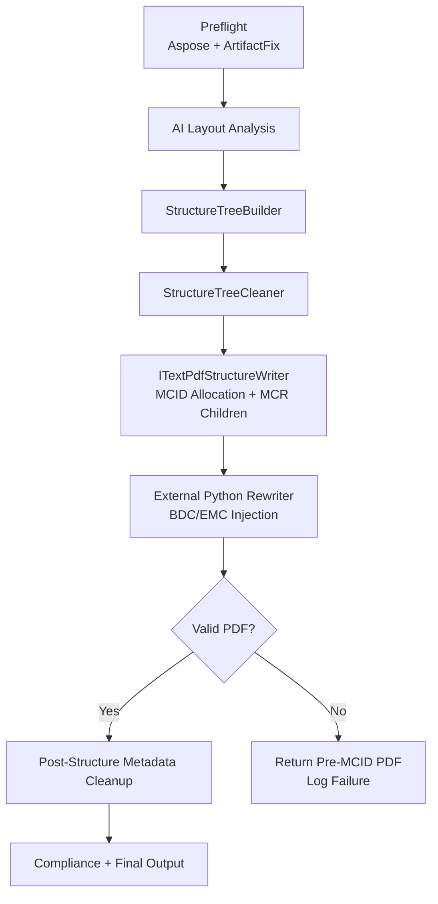

# Phase 6K – Final Reintegration Plan (Claude-Ready)

**Purpose:**  
Provide Claude with the *exact* plan to finish Phase 6K and integrate MCID rewriting without rebuilding the remediation pipeline or duplicating existing components.

This document assumes:

- You already ran a full repository initialization pass
- Claude has mapped the codebase and located all relevant files
- Phase 6K (on the .NET side) **is already fully implemented**

The only remaining work is in the **Python microservice** (Phase 6I/6J).

---

# ✅ High‑Level Summary

Everything on the **C#/.NET side** of Phase 6K is *done*:

| Component | Status | Notes |
|----------|--------|-------|
| StructureRebuildService | ✅ Existing & correct | Integrates tree build + clean + writer |
| ITextPdfStructureWriter | ✅ Complete | MCID assignment + MCR creation |
| MCID allocation | ✅ Implemented | AllocateMcids() is Phase 6K |
| MCR children | ✅ Implemented | Already generating proper StructElem kids |
| Guard clauses | ✅ Implemented | Prevents overwrites after MCID rewrite |
| Pipeline ordering | ✅ Correct | Preflight → Structure → Rewrite |
| RewritePlanBuilder | ✅ Implemented | Produces proper Python plan |
| External Mcid Rewriter | ⚠️ Partially working | Python side needs fixes |

**There is no need to create any new .NET services.**  
The Phase 6K spec *matches what the code already does.*

---

# ❌ Remaining Problem

The **Python microservice** (pikepdf-based) currently:

- inserts BDC/EMC correctly
- but sometimes:
  - destroys page content (wrong operator ranges)
  - clusters all markers in one place
  - generates PDFs that Acrobat will not open
  - or writes changes that iText later discards

This is **Phase 6I/6J**, not 6K.

All remaining work is in **content stream segmentation & safe marker insertion**.

---

# 🎯 The Exact Plan for Claude

Claude should follow this plan exactly.

---

# 1. **Do NOT modify any .NET remediation pipeline code**

Specifically:

- ❌ Do NOT create a new McidAssignmentService  
- ❌ Do NOT move MCID logic out of ITextPdfStructureWriter  
- ❌ Do NOT modify StructureRebuildService ordering  
- ❌ Do NOT rewrite the orchestration pipeline  
- ❌ Do NOT alter guard clause logic  

All of this already matches the Phase 6K spec.

---

# 2. **The ONLY required changes are in Python**

Claude must perform the following:

### 2.1 Segment content streams accurately
- Parse PDF content stream operators into structured objects.
- Track text positioning using Tm/Td/TD.
- Track image placement using Do + preceding cm/q.

### 2.2 Map segments → MCID rewrite plan
- Each segment contains:
  - Start operator index
  - End operator index
  - Bounding box
  - Assigned MCID
  - Page index

### 2.3 Rewrite content streams safely
- Insert `BDC` *before* start operator.
- Insert `EMC` *after* end operator.
- Maintain operator order.
- Preserve entire graphics state.

### 2.4 Save using pikepdf low-level API
- No compression changes.
- No stream merging.
- No object replacement or renumbering.

### 2.5 Validate output
- Must pass **qpdf --check**
- Must open in Acrobat
- Must show MCIDs in PDFix
- Must not break any visuals

---

# 3. Confirm Integration Points (for Claude’s clarity)

These are already correct.

### 3.1 StructureRebuildService pipeline

```
AI → LogicalDoc → StructureTreeBuilder → Cleaner → Writer → Python → Output
```

### 3.2 ITextPdfStructureWriter responsibilities

- Build struct tree
- Assign MCIDs
- Create MCR children
- Generate PdfStructElem objects
- Produce pre-Python tagged PDF
- Invoke external Python rewriter
- Return fully tagged PDF

### 3.3 Guard clauses

Located in:

- RemediationOrchestrator
- StructureRebuildService
- Artifact fix services (disabled post-MCID)
- Preflight font fix relocation

These MUST remain unchanged.

---

# 4. Flowchart for Claude



---

# 5. Success Criteria

Claude must ensure:

- Tags survive iText's closing
- Segments are accurately wrapped
- No corruption in content streams
- PDFs open in Acrobat and PDFix
- Post-MCID phases don't mutate streams
- Final output is PDF/UA-compliant

---

# 6. Files Claude Must Focus On

Only these Python files:

```
phase6j_rewriter.py
content_stream_parser.py
operator_model.py
segmenter.py
rewrite_engine.py
rewrite_plan_applier.py
```

Everything else is off-limits unless a bug is found.

---

# 7. What Claude Should NOT Do

- ❌ Rebuild MCID assignment
- ❌ Modify .NET struct tree builder
- ❌ Change the categorization of nodes
- ❌ Add a second MCID system
- ❌ Reorder structure rebuild pipeline
- ❌ Redo Phase 5 or earlier steps
- ❌ Modify guard clauses
- ❌ Touch post-structure content mutators

These would break existing working remediation.

---

# 8. Deliverables for Claude

1. **Improved segmentation module**
2. **Accurate marker placement algorithm**
3. **Robust rewrite engine**
4. **Binary-safe stream serializer**
5. **Full validation suite**
6. **Integration tests against `.NET` rewrite plans**

---

# ✔ Final Word

Phase 6K is DONE.

Claude's job now is:

> Fix the Python rewriter so that the markers persist, the PDF remains valid, and accessibility tools recognize the MCIDs.

Do **not** modify the working .NET implementation.

---

**Filename:**  
`PHASE-6K-FINAL-REINTEGRATION-PLAN.md`
